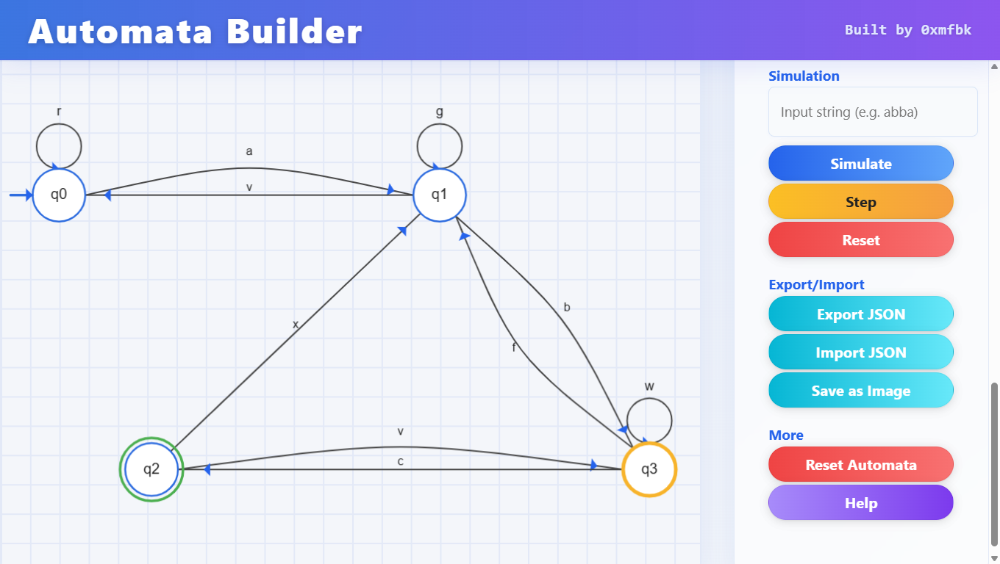

# 🚀 Automata Builder

> A modern, interactive web tool for building, visualizing, and simulating finite automata (DFA, NFA, ε-NFA) with an intuitive drag-and-drop interface and real-time simulation. Perfect for students, educators, and computer science enthusiasts.

> **Interactive, modern, and powerful web tool for building, visualizing, and simulating automata.**

---

## ✨ Overview

Automata Builder is a web-based tool designed to make automata theory accessible, interactive, and fun! Whether you're a student, educator, or computer science enthusiast, this tool lets you create, visualize, and simulate finite automata (DFA, NFA, ε-NFA) with ease. Built for clarity, speed, and a beautiful user experience.

---

## 🎯 Features

- **Intuitive Drag-and-Drop Interface**: Add, move, and edit states and transitions visually.
- **Supports DFA, NFA, ε-NFA**: Switch automaton types on the fly.
- **Step-by-Step Simulation**: Enter input strings and watch the automaton process them in real time.
- **Export & Import**: Save your automata as JSON or PNG images, and load them back anytime.
- **Responsive Design**: Works great on desktops and laptops.
- **Modern UI**: Glassmorphism, gradients, and smooth animations.
- **Accessibility**: Keyboard navigation, tooltips, and clear feedback.

---

## 🖥️ Live Web

  > **[👉 Try Automata Builder Online (0xmfbk)](https://0xmfbk.tiiny.site){:target="_blank"}**

---

## 📚 User Guide

### 1. **Getting Started**
- Open `Live Web`

### 2. **Building Automata**
- **Add State**: Click on empty canvas space to add a new state (auto-named q0, q1, ...).
- **Move State**: Drag a state to reposition it. States snap to a grid and cannot overlap.
- **Rename State**: Double-click a state (on canvas or in the sidebar) to rename. Names must be unique.
- **Set Start/Accept State**: Select a state, then use the sidebar buttons.
- **Delete State**: Select a state, then click Delete.

### 3. **Transitions**
- **Add Transition**: Select a source state, click Add Transition, then click the target state. Enter the symbol(s).
- **Delete Transition**: Click Delete Transition, then click the transition label.
- **Reset Transitions**: Remove all transitions with one click.

### 4. **Simulation**
- Enter an input string in the sidebar.
- Click **Simulate** to run, or **Step** to step through one symbol at a time.
- Current states and transitions are highlighted. The full path is shown after simulation.
- Click **Reset** to clear the simulation.

### 5. **Save, Load, Export**
- **Export JSON**: Save your automaton as a JSON file.
- **Import JSON**: Load a previously saved automaton.
- **Export Image**: Save the automaton diagram as a PNG image.
- **Reset Automata**: Remove all states and transitions to start fresh.

### 6. **Help & Tips**
- Click the **Help** button in the sidebar for a full guide, tips, and FAQ.

---

## 🛠️ Tech Stack
- **HTML5**
- **CSS3** (Glassmorphism, Flexbox, Responsive)
- **JavaScript (ES6+)**
- **[p5.js](https://p5js.org/)** for canvas drawing

---

## 📄 License

[MIT License](LICENSE)

---

## 🙏 Credits

- Built by **0xmfbk**
- UI inspired by modern web design trends
- Thanks to the open source community!

---

> _If you like this project, please ⭐️ the repo and share it!_ 
